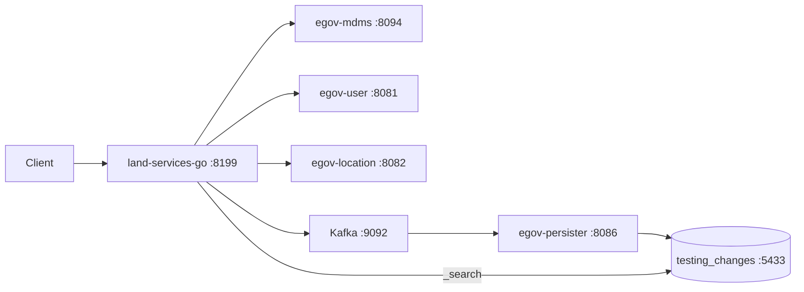

# E2E testing with `run-land-noc-deps.sh`

Use this when core DIGIT services are started by your local dependency script (Postgres on **5433**, MDMS **8094**, location **8082**, user **8081**, Kafka **9092**, persister **8086**).

## 1. Port conflict: Java vs Go land-services

Both bind **8199** at `/land-services`. For Go E2E, **stop Java land-services only** and keep every other service running:

```bash
# From your DIGIT repo root (where run-land-noc-deps.sh lives)
PORT=8199
PID=$(lsof -t -iTCP:"$PORT" -sTCP:LISTEN 2>/dev/null | head -n1)
if [[ -n "$PID" ]]; then
  ps -p "$PID" -o args=
  kill "$PID"    # confirm it's Java land-services before killing
fi
```

Or remove `land-services` from the `SERVICES` array in the script when you only want Go.

Do **not** run `./run-ubuntu.sh --migrate` if Java Flyway already created tables in `testing_changes` — search reads that schema.

## 2. Configure land-services-go

On the same machine (clone [land-service-go](https://github.com/Shivanand-hulikatti/land-service-go)):

```bash
git clone https://github.com/Shivanand-hulikatti/land-service-go.git
cd land-service-go
cp .env.digit-local.example .env
chmod +x run-ubuntu.sh
./run-ubuntu.sh --check
./run-ubuntu.sh          # no --migrate when using testing_changes
```

| Your stack | land-services-go setting |
|------------|--------------------------|
| `PG_PORT=5433` | `LAND_DATABASE_PORT=5433` |
| DB `testing_changes` | `LAND_DATABASE_NAME=testing_changes` |
| `egov-user` :8081 | `LAND_EGOV_USER_HOST=http://localhost:8081` |
| `egov-location` :8082 | `LAND_EGOV_LOCATION_HOST=http://localhost:8082` |
| `egov-mdms-service` :8094 | `LAND_EGOV_MDMS_HOST=http://localhost:8094` |
| Kafka :9092 | `LAND_KAFKA_BOOTSTRAPSERVERS=localhost:9092` |
| Persister :8086 + `land-persister.yml` | topics `save-landinfo` / `update-landinfo` (default) |

Default `configs/app.yaml` uses location **8085** and MDMS **dev.digit.org** — always use `.env` for local stack.

## 3. Smoke tests

**Health** (DB + Kafka should be UP if infra is running):

```bash
curl -s http://localhost:8199/land-services/health | jq .
```

**Search** (reads Postgres; needs existing rows or returns empty list):

```bash
curl -s -X POST 'http://localhost:8199/land-services/v1/land/_search?tenantId=pb.amritsar&limit=10' \
  -H 'Content-Type: application/json' \
  -d @docs/golden/request_info_wrapper.json | jq .
```

**Create** (MDMS + user + location + Kafka + persister):

```bash
curl -s -X POST http://localhost:8199/land-services/v1/land/_create \
  -H 'Content-Type: application/json' \
  -d @docs/golden/land_info_request.json | jq .
```

Then confirm persister consumed the message (egov-persister log on port 8086) and search again by `ids` or `landUId`.

**Postman:**

```bash
newman run docs/postman/land-services.postman_collection.json \
  --env-var baseUrl=http://localhost:8199/land-services
```

## 4. Create/update flow (what must be up)



- **_search**: Postgres only (`testing_changes` on 5433).
- **_create** / **_update**: validation calls MDMS/user/location; persistence is **Kafka → persister → Postgres** (not a direct DB write from Go).

Ensure `PERSISTER_CONFIG_PATH` includes `land-persister.yml` (your script default).

## 5. Troubleshooting

| Symptom | Check |
|---------|--------|
| Health `database: DOWN` | `pg_isready -h localhost -p 5433`; `.env` DB name `testing_changes` |
| Health `kafka: DOWN` | `nc -z localhost 9092`; `digit-kafka` container |
| Create 400 MDMS errors | `curl -s http://localhost:8094/egov-mdms-service/v1/_search` |
| Create OK but no DB row | Persister log; topic `save-landinfo`; `egov-persister` on 8086 |
| Location errors | Host must be **8082**, not 8085 |
| Address already in use 8199 | Java land-services still running — stop it |

## 6. Side-by-side comparison (optional)

Run Go on another port and compare with Java (if Java is still up on 8199, start Go on 8200):

```bash
export LAND_SERVER_PORT=8200
./run-ubuntu.sh
# Java: http://localhost:8199/land-services/...
# Go:   http://localhost:8200/land-services/...
```
